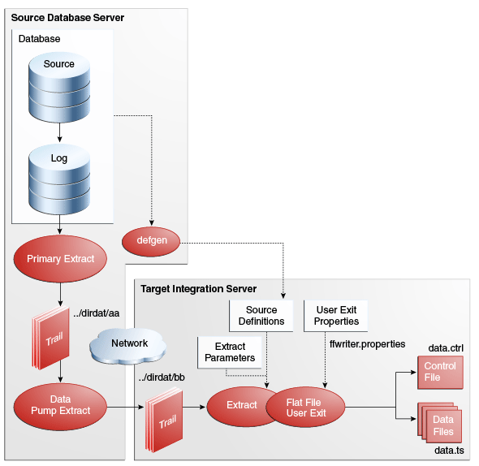

# GoldenGate4EDC-Guide #

# 概述 #

## GoldenGate简介 ##
- GoldenGate是Oracle公司的一款数据库中间件，它基于数据库的二进制日志，实现了数据库集群之间的数据迁移，主要用于数据库之间的同步和备份
- 我们用GoldenGate来实现了对源数据库DML操作的采集，以及将这些操作在远端输出为可供程序读取的文本文件

## 结构简介 ##
- 笔者将GoldenGate部署在两端
- 源端作为数据源，负责从数据库采集数据，生成Trails文件，并发送到目标端
- 目标端作为终点，负责处理从源端传来的Trails文件，并将这些文件转换为文本文件
- 结构图
	
	 


### 源端 ###
- 源端上部署有Oracle和GoldenGate，GoldenGate负责采集Oracle的DML操作并以事务为单位，写入本地Trails文件，同时将Trails文件推送给目标端的GoldenGate
- manager：GoldenGate的监控进程，负责控制GoldenGate的其他组件
- extract：从数据库的二进制日志中抽取变化到Trails文件
- pump：从源端的Trails文件里抽取信息并推送到目标端的Trails文件

### 目标端 ###
- 目标端上的GoldenGate将源端输送过来的GoldenGate文件以特定的规则，转换为特定格式的文本文件
- manager：GoldenGate的监控进程，负责控制GoldenGate的其他组件
- ffwriter：将本地的Trails文件读取并转换为文本文件

### 其他组件 ###
- 组件全都位于GoldenGate的根目录下
- ggsci：GoldenGate的控制台，可以通过这个操作GoldenGate的附属组件。[参考文档](doc/GGSCI_DOC.md)
- defgen：用于生成srcdef文件，供目标端的GoldenGate使用。[参考文档](doc/DEFGEN_DOC.md)
- logdump：用来解析Trails文件。[参考文档](doc/LOGDUMP_DOC.md)

# 环境配置 #
## Oracle设置 ##
- 源端的主机上需要装有数据库，笔者使用的Oracle11g，安装Oracle的过程就不再叙述
- 配置过程需要较高权限，笔者使用的是sysdba
- 开启归档模式

```shell
SQL>alter database archivelog
```

- 开启补充日志

```shell
SQL>alter database add supplement log data;
```
    
- 创建一个账户，用于goldengate的相关操作。需要DBA权限，笔者的账号/密码：goldengate/goldendate
	
## 源端 ##
- 进到GoldenGate目录下
- 启动ggsci，并初始化，如果遇到了报错，就将lib文件下的库放到GoldenGate目录下即可

```shell
$ ./ggsci
GGSCI > CREATE SUBDIRS
```

- 添加需要被采集的表，笔者需要采集test001用户下所有的表

```shell
GGSCI > DBLOGIN USERID goldengate, PASSWORD goldengate
GGSCI > ADD TRANDATA test001.*
```
	
- 配置Manager，输入命令后，开始编辑配置文件mgr.prm


```shell
GGSCI > EDIT PARAMS mgr
```
- 编辑后的mgr.prm文件内容如下

```shell
--配置GoldenGate的端口
port 7999
```
- 启动Manager

```shell
GGSCI > START mgr
```
- 配置EXTRACT，输入命令后开始编辑配置文件ext.prm

```shell
GGSCI > EDIT PARAMS ext
```    
- 编辑后的ext.prm内容如下


```shell
--配置名为ext的EXTRACT
EXTRACT ext
--设置环境变量，Oracle数据库的SID，笔者的SID名为ora
SETENV (ORACLE_SID = "ora")	
--National Language Support (NLS),格式为<Language>_<Territory>.<Clients Characterset> 
--Language指定Oracle消息，时间日期语言；Territory指定货币和数字格式；Clients Characterset指定控制客户端使用的字符集
--设置前最好与DBA沟通
SETENV (NLS_LANG = "AMERICAN_AMERICA.ZHS16GBK")	
-- GoldenGate访问数据库时使用的用户名
USERID goldengate, PASSWORD goldengate	
-- 输出的Trails文件的路径，笔者使用的是GoldenGate目录下dirdat目录里以la开头的一系列文件，这里的"la"只能替换为其他的两个字母
EXTTRAIL ./dirdat/la	
--动态加载TABLE属性中的表，在需要解析大量表的时候，可以显著减少系统延迟
--如果设置为NODYNAMICRESOLUTION，则一次加载所有的表，可能影响系统运行
DYNAMICRESOLUTION
--不对Update操作进行压缩
NOCOMPRESSUPDATES
--采集Update操作之前的值
GETUPDATEBEFORES	
--设置需要采集的表，笔者使用的是text001用户下的所有表
TABLE test001.*;
--如果需要配置单表，可以使用如下语句，假设要配置test用户下的table0和table1；，笔者推荐使用这种方式。
--TABLE test.table0；
--TABLE test.table1;
```

- 将名为ext的EXTRACT加入，以便由GGSCI控制;TRANLOG 表示使用事务日志的方式;BEGIN NOW表示统计从吸纳在开始的事务

```shell
GGSCI > ADD EXTRACT ext, TRANLOG, BEGIN NOW
``` 
- 为ext指定输出文件，需要与配置文件里的EXTTRAIL字段一样

```shell
GGSCI > ADD  EXTTRAIL ./dirdat/la,EXTRACT ext
```

- 启动ext
 
```shell
GGSCI > START EXTRACT ext
```

- 配置pump，执行入命令后，开始编辑配置文件pump.prm
```shell
GGSCI > EDIT PARAMS pump
```
  
- 编辑后的pump.prm内容如下
```shell
--定义EXTRACT的名称为pump
EXTRACT pump
--表示本EXTRACT不生成中间的Trails文件
PASSTHRU	
--目标端GoldenGate的IP和端口
RMTHOST 10.1.130.240, MGRPORT 7999	
--输出的Trails文件的路径，笔者使用的是目标端GoldenGate目录下dirdat目录里以ra开头的一系列文件
RMTTRAILS ./dirdat/ra	
DYNAMICRESOLUTION
--不对UPDATE操作的记录进行压缩
NOCOMPRESSUPDATES	
--声明需要采集的表
TABLE test001.*;
```

- 添加pump，并添加本地源文件
```shell
GGSCI > ADD EXTRACT pump, EXTTRAILSOURCE ./dirdat/la
```
    
- 添加pump的目标文件，需要和配置文件中的RMTTRAILS字段一样

```shell
GGSCI > ADD RMTTRAIL ./dirdat/ra, EXTRACT pump
```

- 启动

```shell
GGSCI > START EXTRACT pump
```
    
## 目标端 ##
- 笔者在目标端中使用了一些和源端相同或相似的变量名，但是并不代表源端与目标端的变量名需要完全一样
- 进入GoldenGate目录
- 启动ggsci，并初始化ggsci，如果遇到了报错，就将lib文件下的库放到GoldenGate目录即可
```shell
GGSCI > CREATE SUBDIRS
```

- 配置manager，执行入命令后，开始编辑配置文件mgr.prm
```shell
GGSCI > EDIT PARAMS mgr
```

- 编辑后的配置文件mgr.prm内容如下
```shell
--配置端口
port 7999
```

- 启动
```shell
GGSCI > START mgr
```
    
- 配置ffwriter，执行入命令后，开始编辑配置文件ffwriter.prm

```shell
GGSCI > EDIT PARAMS FFWRITER
```
   
- 编辑后的配置文件ffwriter.prm内容如下

```shell
--定义名为ffwriter的EXTRACT
EXTRACT ffwriter
--配置数据库的描述文件，文件描述了数据库中表的结构，笔者将文件放在GoldenGate目录下dirdef中，名为srcdef.def
SOURCEDEFS ./dirdef/srcdef.def 
--配置输出文件用的用户接口，笔者使用的是flatfilewriter.so，在GoldenGate目录下
--PASSTHRU表示不生成Trails文件
--INCLUDEUPDATEBEFORES表示包含了update操作中修改前的属性
--PARAMS标注了文件写入器的配置文件，笔者使用的是GoldenGate目录下dirprm中的ffwriter.properties
CUSEREXIT ./flatfilewriter.so CUSEREXIT PASSTHRU INCLUDEUPDATEBEFORES PARAMS "./dirprm/ffwriter.properties"
--配置需要解析的表
table test001.*;	
```

- 添加ffwriter并设定输入路径

```shell
GGSCI > ADD EXTRACT ffwriter, EXTTRAILSOURCE ./dirdat/ra
```
   
- 复制ffwriter.properties文件到dirprm目录下
- 启动

```shell
GGSCI > START EXTRACT ffwriter
```
    
# 准备工作 #

## 检验GoldenGate状态是否正确 ##
- 在源端和目标端的ggsci中查看各组件的状态,均为RUNNING表示健康

```
GGSCI > INFO ALL
```

## 重新生成srcdef.def文件 ##
* 每当被监控的表结构有变动，或者需要添加，删除表时，都要重新执行此步骤
* 参考文档


# 生成文件格式说明 #
## 文件名 ##
- 格式：前缀\_用户名\_表名\_年\_月\_日\_时\_分\_秒\_编号\_后缀
- 每个表会有一组文件来记录其改变
- 如果有持续的事务提交，每10秒会生成一个新的文件[需要看配置文件]
- 文件的编号从00000开始递增
- 文件名可配置，在ffwriter.properties文件中配置

## 文件内容 ##
- 格式："事务类型"|" DML操作类型"|"时间"|"用户名""表名"|"Key"|Before Value|After Value[|"Key"|Before Value|After Value]...
- 事务类型
- DML操作类型
- 在不同操作时KV的呈现
- 笔者的占位符为\<NULL\>

* INSERT语句
	* Before Value均被占位符占据
	* After Value被INSERT语句中对应的值占据，如果没有插入，则被占位符占据

* UPDATE语句
	* 主键不论修改与否，始终显示
	* 被修改的值，Before Value和After Value分别显示修改前和修改后的值，如果为NULL则由占位符填充
	* 不参与修改的值内容为空，只显示字段名

* DELETE语句
	* 对于主键，只在Before Value显示删除操作之前的值，After Value为占位符
	* 其他值内容为空，只显示字段名

* [实验记录](doc/DIROUT_CASE.md)


# 配置文件格式说明 #
* [输出配置文件ffwriter.properties](doc/ffwriter.properties)


